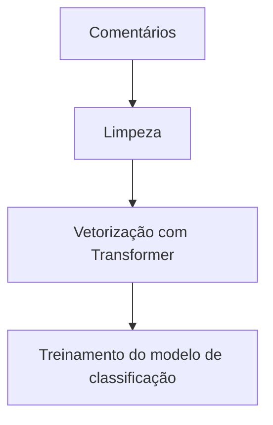
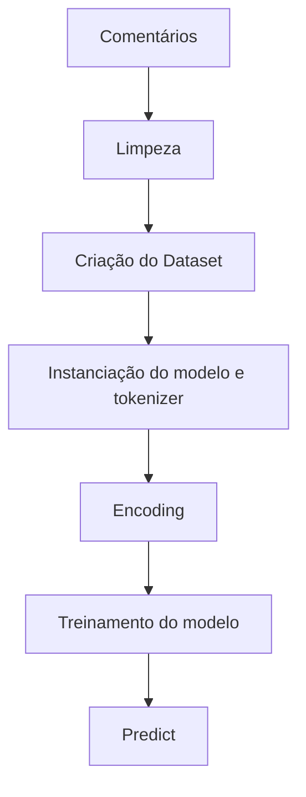
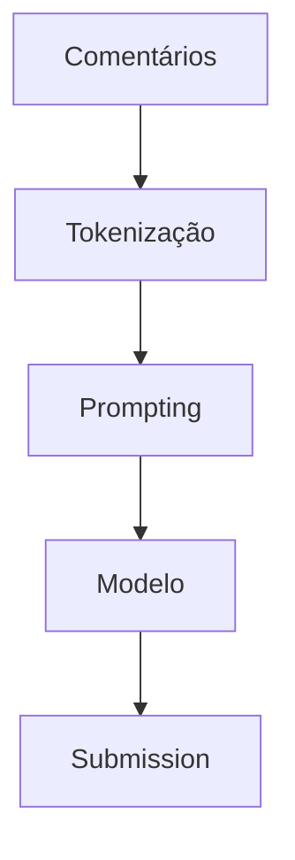
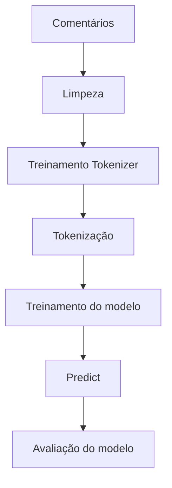

# Objetivo

Este documento tem como objetivo apresentar os resultados/insights/metodologias obtidos na execução dos experimentos realizados para avaliar o desempenho de diferentes estratégias de classificação de comentários tóxicos em português.

Não vou trazer nada sobre EDA aqui, por ser algo que eventualmente eu retorno para buscar novos insights nos dados.

# Organização dos arquivos

Cada experimento aqui é organizado por script dentro do diretório de src, com nome de arquivo `modeling_XX.py`. Onde `XX` é um número sequencial que indica a ordem de execução dos experimentos.

# Experimento 01

- Consistiu em vetorizar o dado utilizando um transformer pré-treinado, em seguida o resultado é enviado para um modelo de classificação.
- Foram testados vários transformers e modelos de classificação.

Esquema do pipeline:

# Experimento 02

- Nesse caso estou fazendo um fine-tuning de um modelo transformer pré-treinado.
- Também testei alguns modelos transformers, por enquanto é o experimento que deu a melhor performance.
- Aqui também ta todo o fluxo com o Datasets da HF. Isso facilitou o pré-processamento e a divisão dos dados.
- Um pouco da complexidade aqui é abstraída pelas classes da HF, de AutoModelForSequenceClassification e AutoTokenizer, e o uso do Trainer.
  - Um ponto que vale um estudo maior aqui é o de como essas classes funcionam. Talvez fazer essas implementações de forma mais manual, pra pegar a maldade.

A criação de checkpoints do modelo foram abstraídos pelo Trainer.

# Experimento 03

- Utilização do modelo da Maritaka, o Sabiá-7B. Não foi feito fine-tuning aqui, apenas a utilização do modelo pré-treinado.
- O prompt passado foi um few-shot.
- A performance aqui foi bem ruim, em torno de 0.56 de acurácia.

# Experimento 05

- Esse modelo é semelhante ao experimento 03, só que aqui foi feito a conexão com a openai.

# Experimento 06

- Muito semelhante ao experimento 02, mas aqui estou realizando uma limpeza mais agressiva nos dados. Mas de resto segue igual.

# Experimento 07

- Nesse experimento estou realizando o treinamento de um tokenizer e um modelo de classificação mais simples.
- Essa estratégia foi utilizada numa competição do kaggle, e tinha funcionado muito bem.

# Experimento 08

- Semelhante a outros experimentos da openai, porém com mais exemplos no few-shot.

# Experimento 09

- Tentativa de utilizar a API da openai de moderação.

# Experimento 11

- Utilização do modelo tunado da openai para classificação de comentários.

# Experimento 12

- Tentativa de utilizar o mais básico do básico, com tfidf pra vetorizar os textos, utilizando um processo de limpeza mais agressivo.
